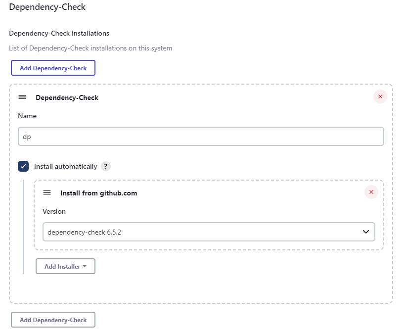
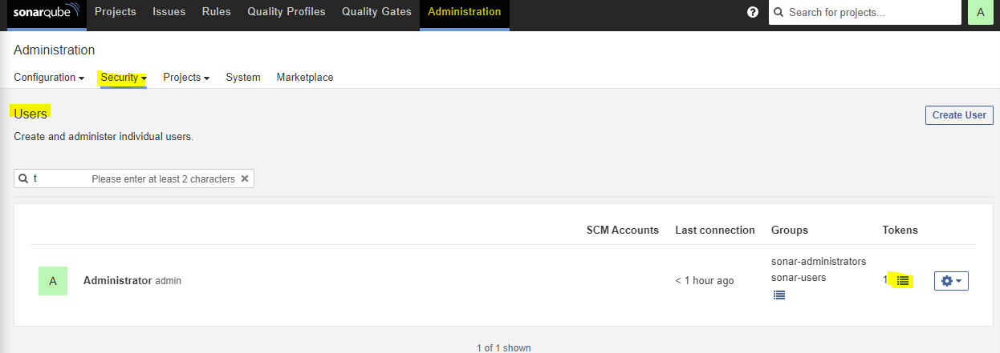

# JENKINS CICD PROJECT - SONARQUBE 


# Create a Jenkins Server with Terraform

- We have [terraform file ](main.tf)  to create Jenkins Server
- We have [bash scripted user data](userdata.sh) to store our bash scripts
- Check the repo -> https://github.com/sinemozturk/Jenkins-server-with-Terraform to read how to use the terraform file. 

# INTALL JENKINS, JAVA, MAVEN 

- As we know Jenkins is using Port `8080 ` as default we will change to `8082`.

- First of all we need to ssh into Jenkins Server and check if everything is working correctly or not? 

- Check if Java is installed

```bash
java -version
```


- Check if Maven is installed

```bash
mvn -v
```


- Check if Tomcat is installed

```bash
sudo systemctl status tomcat9
```


- Check if Jenkins is running

```bash
sudo systemctl status jenkins
```


- To check is jenkins working correctly on port 8082 go to browser and type your link like following:

```text
http://<<public-ip-of-your-ec2:8082>>
```


- As you can see we successfully make the port change from 8080 to 8082 now we need to set up jenkins with initial administration password, go to related file with following;

```bash
cd /var/lib/jenkins/secrets
```

```bash
cat initialAdminPassword
```


- Now go into the jenkins and paste the password and create an admin account, you can see detailed explanation and installation of Jenkins on my github - > https://github.com/sinemozturk/Jenkins-CI-CD-Pipeline


# Jenkins Plugins Should be Installed; 

- Go to `Manage Jenkins` tab, and navigate `Manage Plugins` this is the place where actually you can download project related tools and technologies' plugins. Navifate to `Available Plugins` tab.
    - write `jdk` on search bar and click and install without restart following plugins;
        - `Eclipse Temurin installer`
        - `openJDK-native-plugin `

    - write ` owasp ` on search bar and click and install without restart following plugins;
        - `OWASP Dependency-CheckVersion 5.5.0 `  
    - write ` docker ` on search bar and click and install without restart following plugins;
        - `Docker`
        - `Docker Pipeline`
        - `docker-build-step`
        - `CloudBees Docker Build and Publish`
    - write ` sonarqube ` on search bar and click and install without restart following plugins;
        - `SonarQube Scanner `


## Global Tool Configuration

In Jenkins, the "Global Tool Configuration" section allows administrators to configure and manage global tools that can be used across all Jenkins jobs. These tools typically include build tools, version control tools, JDK installations, and other command-line utilities required for software development and build processes.

- Navigate the `Global Tool Configuration` bar on dashboard. We will configure Java, Maven, Docker and Dependency-Check.

    

    - For Java `JDK` give name as `jdk`, click `Install automatically` and choose the version of jdk. You can see in details with following; 

        

    - For Maven  give name as `maven`, click `Install automatically` and choose the version of maven. You can see in details ;

        

    - For Dependency-Check give name as `dp`, click `Install automatically` and choose the version of maven. You can see in details ;

        

    - For Docker give name as `docker`, click `Install automatically` and choose the version of maven. You can see in details ;

        


    - Save and Apply changes. 

# INSTALL APACHE TOMCAT 


- We need to install Apache Tomcat with following bash command; 

```bash
sudo wget https://archive.apache.org/dist/tomcat/tomcat-9/v9.0.65/bin/apache-tomcat-9.0.65.tar.gz
```

- As you can see above file extention is tar.gz , it is a zip file which we need to extract it. 

```bash
sudo tar -xvf apache-tomcat-9.0.65.tar.gz
```

- As you can see we have lots of files inside the conf folder. Now we need to make some changes in the tomcat server to make sure Tomcat is allowing the administrative access through its web interface by adding a new user with appropriate roles to the  `tomcat-user.xml` configuration file. Run following command to start making changes.

```bash
sudo vi tomcat-users.xml
# ---add-below-line at the end (2nd-last line)----
# <user username="admin" password="admin1234" roles="admin-gui, manager-gui"/>
```
- Now we need to create a symbolic link allows for easier access to the Tomcat `startup` script, enabling users to start Tomcat by simply executing startTomcat from the command line, without needing to navigate to the Tomcat installation directory.


```bash
sudo ln -s /opt/apache-tomcat-9.0.65/bin/startup.sh /usr/bin/startTomcat
```
- Now we need to create a symbolic link allows for easier access to the Tomcat `shutdown` script, enabling users to stop Tomcat by simply executing stopTomcat from the command line, without needing to navigate to the Tomcat installation directory.

```bash
sudo ln -s /opt/apache-tomcat-9.0.65/bin/shutdown.sh /usr/bin/stopTomcat
```

- Now we need to configure the  `context.xml` file with following command; 


```bash
sudo vi /opt/apache-tomcat-9.0.65/webapps/manager/META-INF/context.xml
```

- We need to comment following scripts :

```
 <Valve className="org.apache.catalina.valves.RemoteAddrValve"
         allow="127\.\d+\.\d+\.\d+|::1|0:0:0:0:0:0:0:1" />
```

- Now we need to configure the host-manager in the `context.xml` file. This file typically contains configuration settings specific to the host-manager web application in Apache Tomcat.

```bash
sudo vi /opt/apache-tomcat-9.0.65/webapps/host-manager/META-INF/context.xml
```

- Same steps with above comment the following scripts : 

```
<!-- Valve className="org.apache.catalina.valves.RemoteAddrValve"
  allow="127\.\d+\.\d+\.\d+|::1|0:0:0:0:0:0:0:1" /> -->
```


- Now we need to stop the Tomcat which was running when we used previous commands.The command `sudo stopTomcat` appears to be an attempt to stop the Apache Tomcat server using a custom command stopTomcat that you may have created earlier with the `ln` command. This command would work if you have created a `symbolic link` named stopTomcat that points to the `shutdown.sh` script in the Tomcat bin directory, as discussed earlier.


```bash
sudo stopTomcat
```


- Now we can start the Tomcat with following command;

```bash
sudo startTomcat
```


# PIPELINE 

- Go to dashboad and click New Item write a name for your job, and choose Pipeline.

- Click Discard old builds write 1 to Max # of builds to keep

- Scroll down to Pipeline and choose Execute Shell and write following code;

```groovy
pipeline {
    agent any

    stages {
        stage('Git Checkout') {
            steps {
                git branch: 'main', url: 'https://github.com/jaiswaladi246/Petclinic.git'
            }
        }
        stage('Compile') {
            steps {
                sh "mvn clean compile"
            }
        }
        stage('Build') {
            steps {
                sh "mvn clean package"
            }
        }
        stage('Deploy') {
            steps {
                sh "sudo -S cp target/petclinic.war /opt/apache-tomcat-9.0.67/webapps" 
            }
        }
    }
}

```

- And apply changes and go back to pipeline and Build Now

- To follow step by step each pipeline stages check this repo -> https://github.com/sinemozturk/Jenkins-CI-CD-Pipeline


- Go to your browser copy paste your public ip of your instance and add `:8080/petclinic` at the end, you will be able to see the application is being deployed on your `Tomcat` server.


## ⚠️⚠️ Troubleshooting if `Deploy` Stage is Failing; ⚠️⚠️

- If the Deploy stage is giving error like following; 

```text
+ sudo cp target/petclinic.war /opt/apache-tomcat-9.0.67/webapps
sudo: a terminal is required to read the password; either use the -S option to read from standard input or configure an askpass helper
```

- You can configure sudo to allow passwordless execution of the cp command by adding an entry to the sudoers file. This allows the Jenkins user to execute the cp command without needing to enter a password.

- You can edit the sudoers file using the visudo command (it's important to use visudo to ensure correct syntax and prevent locking yourself out due to syntax errors):

```bash
sudo visudo
```

- Add the following line to the sudoers file:

```css
jenkins ALL=(ALL) NOPASSWD: /bin/cp
```

- Replace jenkins with the actual username Jenkins is running under, if it's different.

- This line allows the jenkins user to execute the `cp` command without a password.


# SONARQUBE

`SonarQube` is an `open-source platform` developed by SonarSource for `continuous inspection of code quality` to perform automatic reviews with static analysis of code to detect `bugs`, `code smells`, and `security vulnerabilities`. It supports various programming languages including Java, C#, JavaScript, TypeScript, Python, and many others.

- SonarQube provides a dashboard to track the health of an application's source code. It offers a wide range of features including:

- Static Code Analysis: It analyzes source code for bugs, vulnerabilities, and code smells without actually executing the code.

- Code Smells Detection: Identifies parts of the code that may indicate problems with the code design.

- Security Vulnerability Detection: Identifies security vulnerabilities in the code such as injection flaws, XSS, etc.

- Code Duplication Detection: Identifies duplicated code blocks, enabling developers to refactor their codebase.

- Code Coverage: Measures how much of the codebase is covered by automated tests.

- Integration with CI/CD: Can be integrated into Continuous Integration and Continuous Deployment pipelines to automatically analyze code quality on every build.

- Customizable Quality Profiles: Allows customization of quality profiles and rulesets based on project requirements.

- Reporting: Generates detailed reports on code quality metrics and issues.

- Multi-language Support: Supports a wide range of programming languages and frameworks.


## Summary

SonarQube does; 
- `Code Quality Check` : refers to the process of analyzing source code to identify potential issues such as bugs, code smells, security vulnerabilities, and adherence to coding standards.
- `Code Coverage` : Measures how much of the codebase is covered by automated tests.


# DOCKER, DOCKER COMPOSE & SONARQUBE Installation on Jenkins Server

- We will installed docker  to able work on this project. I will explain the docker in other stage of this project for now just run and install following commands one by one on your Jenkins Server. 


```bash
--- Docker Installation ---

sudo apt-get update
sudo apt-get install ca-certificates curl gnupg

sudo install -m 0755 -d /etc/apt/keyrings
curl -fsSL https://download.docker.com/linux/ubuntu/gpg | sudo gpg --dearmor -o /etc/apt/keyrings/docker.gpg
sudo chmod a+r /etc/apt/keyrings/docker.gpg

echo \
  "deb [arch="$(dpkg --print-architecture)" signed-by=/etc/apt/keyrings/docker.gpg] https://download.docker.com/linux/ubuntu \
  "$(. /etc/os-release && echo "$VERSION_CODENAME")" stable" | \
  sudo tee /etc/apt/sources.list.d/docker.list > /dev/null

sudo apt-get update

sudo apt-get install docker-ce docker-ce-cli containerd.io docker-buildx-plugin docker-compose-plugin

sudo apt install docker-compose

service docker restart
sudo usermod -aG docker $USER
newgrp docker
sudo chmod 666 /var/run/docker.sock
sudo systemctl restart docker


# TO ISNTALL SONARQUBE USING DOCKER RUN BELOW COMMAND  
docker run -d --name sonar -p 9000:9000 sonarqube:lts-community

```

- Check if docker is being installed; 

```bash
docker -v
```


- After making sure the docker and docker compose is being installed run the following command; 

```bash
docker run -d --name sonar -p 9000:9000 sonarqube:lts-community
```

- This command starts a Docker container named "sonar" running SonarQube Community Edition in detached mode, allowing you to access SonarQube's web interface on port 9000 of your host machine.

    - `docker run`: This command is used to create and start a new Docker container based on a specified Docker image.
    - `-d`: This flag specifies that the container should run in detached mode, meaning it will run in the background.
    - `--name sonar`: This option sets the name of the Docker container to "sonar". This allows you to easily identify and manage the container.
    - `-p 9000:9000`: This option specifies port mapping, where port 9000 of the host machine is mapped to port 9000 inside the Docker container. This is necessary for accessing SonarQube's web interface, as SonarQube typically runs on port 9000.
    - `sonarqube:lts-community`: This is the Docker image that will be used to create the container. In this case, it's the SonarQube LTS (Long-Term Support) Community Edition image.


- ⚠️⚠️⚠️NOTE⚠️⚠️⚠️: make sure your ec2 instans is allowing the port number `9000` you can simply go to your security groups on your ec2 and add inboud rules to allow tcp all trafic to port number 9000. 

- Check sonarqube image is running on docker container; 

```bash
docker ps
```


- Go to your browser and access the `sonarqube` with port `:9000`


- When you use first time the sonarqube `login` is `admin`and  `password` is `admin` as well to login. After logged in change the password on your choice. 

- You will see sonarqube landing page; 


`Projects`: In SonarQube, projects represent the codebases or software applications that are being analyzed for code quality and issues.

`Issues`: Issues refer to code violations or problems identified during code analysis, such as bugs, vulnerabilities, or code smells.

`Rules`: Rules define the criteria used by SonarQube to analyze code and detect issues. They specify coding standards, best practices, and potential problems that should be flagged.

`Quality Profiles`: Quality profiles are sets of rules and configurations applied to projects during code analysis. They define the coding standards and quality gates used to evaluate code quality.

`Quality Gates`: Quality gates are criteria or thresholds used to assess whether a project meets quality standards. They define conditions that must be met for a project to pass the quality check.

`Administration`: Administration encompasses the management and configuration of SonarQube instances, including user management, setting up projects, configuring analysis parameters, and managing plugins and extensions.


## Global Tool Configuration for SonarQube

- Go to `Jenkins` Dashboard -> `Manage Jenkins` and navigate to `Global Tool Configuration` and find the `SonarQube` it is there because we installed related plugin. 

- Provide a name with `sonar-scanner` and choose `install automatically` and choose the latest version. 


## Generate Token from SonarQube

- Go to `SonarQube` dashboard and go `Administation` -> `Users` -> Click `Admin's icon` below image and give a name and save the token. 




## Configure Crendentials for SonarQube in Jenkins Server

- Go to `Jenkins` dashboard -> `Manage Jenkins` -> `Credentials` and add credential 
    - `Kind` : Secret text
    - `Secret`: Paste the Sonar's token
    - `Description`: sonar-token 


## Configure SonarQube Server with `Confgure System`

- Go to Jenkins Dashboard and navigate to `System` and find the `SonarQube` add sonarqube provide the information and apply changes
    - `Name`: sonar-server
    - `Server URL` : http//:<<publicIP>>:9000/
    - `Server authentication token`: choose `sonar-token`


# PIPELINE WITH SONARQUBE

- Go back to pipeline script and let's modift with sonarqube stage

- 